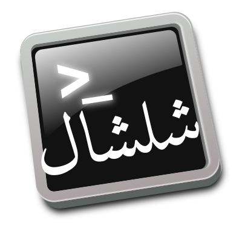

# Shellshal
Shell Scripts for Arabic Language processing
سكريبتات سطر الأوامر للتعامل مع النصوص العربية



## Description
This project is a collection of small shell scripts used to process arabic texts, like:

- Tokenize a file text into tokens (duplicate, unique)
- Strip Tashkeel from text ( all diacritics, keep shadda, last haraka )
- Strip only the last mark from every word in text.
- Convert Alef_Wasla into Alef
- Build a list from csv file

هذا المشروع يجمع سكريبتات بسيطة لمعالجة الملفات النصية العربية مثل:

- تفريق نص إلى كلمات
- تفريق النص، وحذف المكررات
- حذف التشكيل، حذف الحركات وحفظ الشدة، حذف آخر حركة
- تحويل ألف الوصلة إلى ألف عادية
- تحويل ملف نصي csv إلى قائمة

## التسمية
شَلْشَلَ
    [ ش ل ش ل ]. ( فعل : رباعي لازم متعد ). :- شَلْشَلْتُ ، أُشَلْشِلُ ، شَلْشِلْ ، مصدر شَلْشَلَةٌ .
    1 . :- شَلْشَلَ الْمَاءَ :- : صَبَّهُ مُتَتَابِعاً .
    2 . :- شَلْشَلَ الْمَاءُ :- : قَطَرَ وَسَالَ مُتَتَابِعاً .
    3 . :- شَلْشَلَ السَّيْفُ الدَّمَ :- : صَبَّهُ .
    
الاسم مأخوذ من شبهه بكلمة shell التي تعني سطر الأوامر، 

والمعنى في الشلشلة هي التتابع

## Usage

### Install

```shell
make install
```
### Test
```shell
make test
```
### Scripts

Display all possible command by using 

```shell
shellshal
```

### Commands

#### Tokenize

1- You can tokenize a text file by the following script.
```
tokenize.sh filename
```
###### source
```shell
sed 's/[[:punct:][:space:]×،؛]/\n/g'  < $1 |sed '/^\s*$/d'
```

2- Tokenize, sort, removre duplicates and count frequencies for words in file. The result file is filename.unq.
```
tokenize_uniq.sh filename
```
###### source
```shell
sed 's/[[:punct:][:space:]×،؛]/\n/g'  < $1 |sed '/^\s*$/d' | sort | uniq -c | sort -nr >$1.unq
```

##### Tashkeel Removing
1- Remove Harakat (diacritics), Tatweel and Shadda from text

```
strip_tashkeel.sh filename
```
source

```shell
CHARS=$(python -c 'print u"\u064b\u064c\u064d\u064e\u064f\u0651\u0652".encode("utf8")')
sed 's/['"$CHARS"']//g' < $1
```

2- Remove Harakat (diacritics) and Tatweel  from text, but keep Shadda

```
strip_harakat.sh filename
```

source

```shell
CHARS=$(python -c 'print (u"\u064b\u064c\u064d\u064e\u064f\u0650\u0652\u0670".encode("utf8"))')
sed 's/['"$CHARS"']//g' < $1
```


3- Remove last Haraka (diacritic) from the end of words from text

```
strip_lastmark.sh filename
```
source

```shell
CHARS=$(python -c 'print u"\u064b\u064c\u064d\u064e\u064f\u0651\u0652".encode("utf8")')
sed 's/['"$CHARS"']$//g' < $1
```

4- Replace Alef wasla to simple alef in  words from text


```shell
replace_wasla.sh filename
```

source

```shell
CHARS=$(python -c 'print (u"\u0671".encode("utf8"))')
TO=$(python -c 'print (u"\u0627".encode("utf8"))')
sed 's/['"$CHARS"']/'"$TO"'/g' < $1
```

##### Build lists and dictionary

1-Makelist Convert file into list; csv file or one word per line

```
shellshal/makelist.sh testfile.csv
```
source

```
awk 'BEGIN{print "MyList=["};/^[^#]/{printf "u\"%s\",\n",$1};END{print "]"}' $1
```
